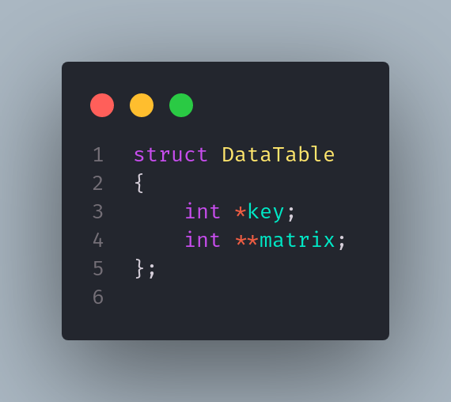
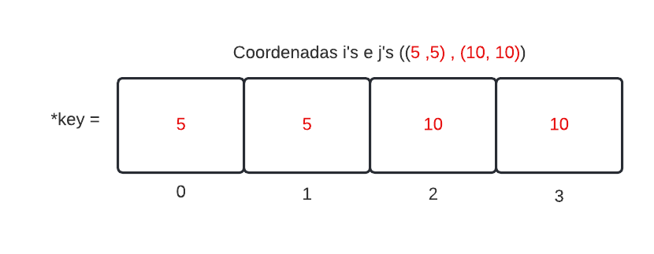
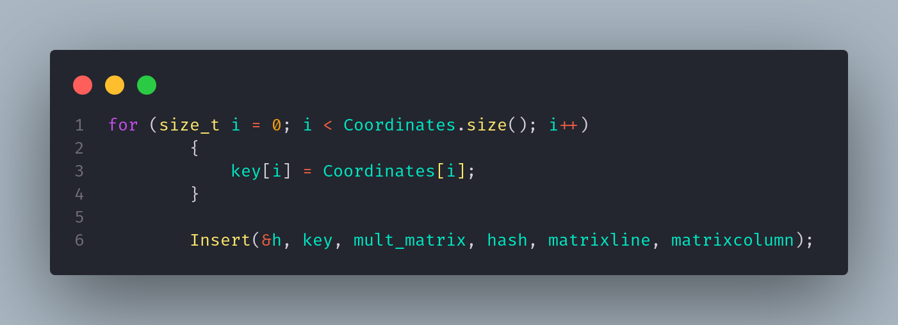
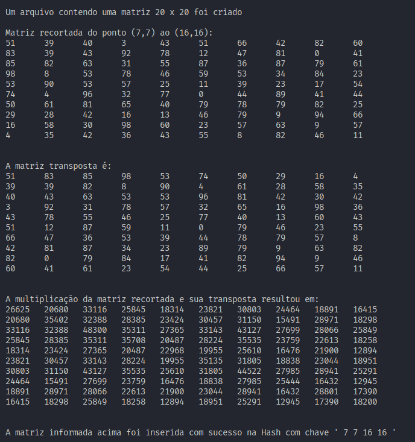

# Trabalho de Aquecimento

<h1> Processamento de matrizes por segmentação de arquivo

## Conteúdos

    <a href="#apresentação">Apresentação</a> •
    <a href="#lógica">Lógica</a> • 
    <a href="#manual-de-execução">Manual de Execução</a> • 
    <a href="#bibliotecas">Bibliotecas</a> •
    <a href="#compilação-e-execução">Compilação e Execução</a> •
    <a href="#autor">Autor</a>

---

## Apresentação

Foi proposto pelo professor [Michel Pires da Silva](http://lattes.cnpq.br/1449902596670082) da matéria de `Arquitetura e Estruturas de Dados 2 do 4º Período do curso de Engenharia de Computação` um pequeno trabalho introdutorio para que fosse possível aquecer e relembrar contéudos aprendidos no período anterior sendo eles, `Estruturas de Dados Hash`, `Manipulação de Arquivos` , `Manipulação de Matrizes`, `Ponteiros` entre outros diversos tópicos. Esse trabalho foi passado com o seguinte proposito:

    Cada aluno deve implementar um sistema de multiplicação de matrizes baseando-se em uma estratégia de segmentação em arquivo. Um arquivo M grande é fornecido no formato NxN com valores de ponto flutuante ou inteiros como entrada. 
    Este é processado a partir de várias coordenadas introduzidas por um segundo arquivo, o coordenadas.txt. Em coordenadas.txt deve ser descrito por linha uma dupla de i e j correspondendo a posição inicial e final a ser lida. 
    Por exemplo, as posições 2,4,6,10 indica que a leitura em M deve iniciar na linha 2 coluna 4 e seguir até a linha 6 coluna 10. 

    Feito a leitura da composição de M para um tipo matriz em C, a segunda etapa é produzir a transposta de M. 
    Feito isso, produza a multiplicação e armazene em uma hash o resultado da multiplicação como valor para a dupla de i's e j's, os quais deverão ser utilizados como chaves da hash.
     Assim, para cada novo calculo, antes o sistema deve consular a hash para identificar se a multiplicação já foi realizada. Em caso afirmativo, retorne apenas a resposta já calculada. 
     Caso contrário, elabore a multiplicação e armazene o conteúdo em cache. 

Com isso, foi trabalhada a lógica abaixo, que obteve êxito apresentando uma solução para este trabalho!

---

## Lógica

Para a solução do problema proposto, foi utilizado a `Estrutura de Dados Tabela Hash De Endereçamento Fechado` onde a mesma foi utilizada de um repositorio feito pelo professor [Michel Pires da Silva](http://lattes.cnpq.br/1449902596670082) sendo ele [HashTable](https://github.com/mpiress/HashTable), foram feitas algumas alterações como conversão da linguagem *__C__* para *__C++__* e mudanças dos itens _key_ e _value_, passando-os do tipo __int__ para __vetor__ e __matriz__ como é possível ver abaixo.

 Para o tratamento da proposta onde a _key_ seria as duplas i's e j's foi pensando em transformar a váriavel em um vetor dinâmico onde armazenaria cada coordenada em uma possição e assim seria feita uma chave composta por 4 posições e algarismos como na representação abaixo:

O programa foi desenvolvido com basicamente duas funções principais, onde escreve no arquivo e outro manipula o arquivo fazendo então a segmentação das matrizes sendo elas __EscritaArquivo()__ e __ManipulaArquivo()__. Para introduzir o desenvolvimento da solução foi feita primeiro a chamada da função __EscritaArquivo()__ , retornando uma váriavel do tipo inteiro, foi feita com o intuito de ser a função em que irá pedir como entrada ao usuário o tamanho da matriz principal em que vai ser escrita no arquivo `matrix.txt` onde vai retornar seu tamanho com inteiro para que possa ser feita a manipualação e segmentação da matriz com seus valores corretos na proxima função.
A função __ManipulaArquivo()__ vai constituir na função principal onde vai receber como parametro o tamanho da matriz captado na função anterior e com isso iniciar o processo de segmentação onde conterá uma estrutura de repetição `WHILE` que vai repetir enquanto o usuário optar por continuar fazendo a segmentação da matriz através de uma entrada, a primeira vez que for feita a repetição as *coordenadas* serão captadas através do arquivo `coordenadas.txt` onde o usuário irá inseri-las como informado no <a href="#manual-de-execução">Manual de Execução</a>, para a segunda segmentação em diante será necessário interação do usuário com o programa informando as coordenadas onde cada uma vai ser armazenada em uma posição do _vector_ chamado __Coordinates__ para o facilitamento da manipulação e passando essas posições para variaveis locais possibilitando o cálculo de linhas e colunas da matriz segmentada, com isso então é feita a verificação onde através de duas estruturas de repetição `FOR` e uma estrutura de decisão `IF` que verifica se cada posição do _vector_ é semelhante a cada posição de alguma key presente já na `Tabela Hash`, em caso de semelhança de coordenas é informado ao usuário que já foi feita aquela segmentação e é imprimida a matriz segmentada presente já na `Tabela Hash` encerrando então o programa. Após a verificação e não encontrada nenhuma coordenada semelhante será feita a segmentação da matriz principal de acordo com as coordenadas passadas onde primeiramente constituirá em uma matriz do tipo _string_ alocada dinâmciamente que vai ser preenchida da seguinte forma:
Vai ser utilizada uma estrutura de repetição `FOR` que vai ser repetida de acordo com o tamanho da matriz principal onde a cada repetição vai ser lida a linha do arquivo `matrix.txt` através da função __*getline()*__ e será considerada apenas as linhas que estiverem entre a linha da primeira e segunda coordenada informada.
Onde assim que cada linha for considerada vai ser feita a tokenização, utilizando a função __*istringstream*__, daquela linha possibilitando o reconhecimento de cada valor presente, inserindo-os em um _vector_ denominado __tokens__ e a partir disso que vai ser colocado os valores dentro da matriz do tipo _string_, onde apenas os valores presentes na posição do vector que corresponde estar entre as colunas informadas na coordenada que vão ser introduzidos nessa matriz. Diante disso vai ser feita a conversão dessa matriz do tipo _string_ para uma matriz alocada do tipo _int_, utilizando a função __*stoi*__, para que seja possível ser feita a multiplicação entre matrizes. Será alocada uma nova matriz onde vai ser a matriz transposta da segmentada e com isso será feita uma multiplicação com essas duas matrizes (a matriz segmentada e sua transposta), como informado na proposta do trabalho, onde apartir disso será colocado os valores dessa multiplicação em uma nova matriz que vai ser introduzida em uma `Tabela Hash`, em conjunto com a _key_ que são as coordenadas, utilizando sua função __Insert__ como na linha de código a seguir: 

Feito essa inserção na `Tabela Hash` será acrescentada mais um valor na variavel _hash_ onde a mesma é responsável para o caminhamento da `Tabela Hash` e então voltando para a interação com o usuário possibilitando novas segmentações

•A imagem abaixo representa a finalização de uma etapa de segmentação imprimida pelo algoritmo desenvolvido onde as coordenadas do primeiro ponto foram *(7,7)* e do segundo ponto foi *(16,16)*, sendo a matriz principal uma matriz *20x20*:

---

## Manual de utilização

Entre os arquivos acompanhados com o algoritmo está presente o arquivo `coordenadas.txt`, onde o mesmo deverá ser preenchido antes da <a href="#compilação-e-execução">compilação e execução</a> inserindo as coordenadas da mesma maneira (até a posição das vŕgulas), como mostrado a seguir:

onde os valores (*7*, *7* ) são o i e j da primeira coordenada e (*16*, *16* ) são os da segunda.

__*OBS:*__ este método é utilizado para informar as coordenadas apenas da primeira segmentação, apartir da segunda é necessário a interação do usuário com o algoritmo no momento em que requerir a entrada em sua execução

Após a compilação do programa a primeira interação do usuário com o algoritmo será para informar o tamanho da matriz principal que estará contida em um arquivo `matrix.txt` que vai ser criado após o fornecimento do tamanho da matriz, sendo necessário informar apenas um valor por se tratar de uma matriz principal quadrada, sendo esse valor a quantidade de linhas e colunas presente na mesma.

A segunda interação do usuário será após a primeira segmentação em que perguntará ao usuário se deseja continuar fazendo segmentações. O usuário deverá inserir apenas __'S'__(Sim) ou __'N'__(Não), indepedente de ser maiusculo ou minusculo. Caso a resposta seja positiva o usuário deverá informar novas coordenadas como informado na observação anterior. A resposta negativa levará a finalização do programa

---

## Bibliotecas

Para o funcionamento do programa, é necessário incluir as seguintes bibliotecas: 
<ul>
    <li><code>#include 'stdbool.h'</code></li>
    <li><code>#include 'fstream'</code></li>
    <li><code>#include 'iostream'</code></li>
    <li><code>#include 'stdlib.h'</code></li>
    <li><code>#include 'vector'</code></li>
    <li><code>#include 'string'</code></li>
    <li><code>#include 'sstream'</code></li>
</ul>

---

## Compilação e Execução

O programa feito de acordo com a proposta possui um arquivo Makefile que realiza todo o procedimento de compilação e execução. Para tanto, temos as seguintes diretrizes de execução:

| Comando                |  Função                                                                                           |                     
| -----------------------| ------------------------------------------------------------------------------------------------- |
|  `make clean`          | Apaga a última compilação realizada contida na pasta build                                        |
|  `make`                | Executa a compilação do programa utilizando o gcc, e o resultado vai para a pasta build           |
|  `make run`            | Executa o programa da pasta build após a realização da compilação             

---

## Autor

Desenvolvido por [Pedro Henrique Louback Campos](https://github.com/PedroLouback)

Aluno do 4° periodo do curso de `Engenharia de Computação` no [CEFET-MG](https://www.cefetmg.br)